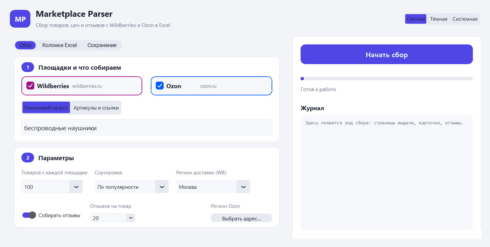
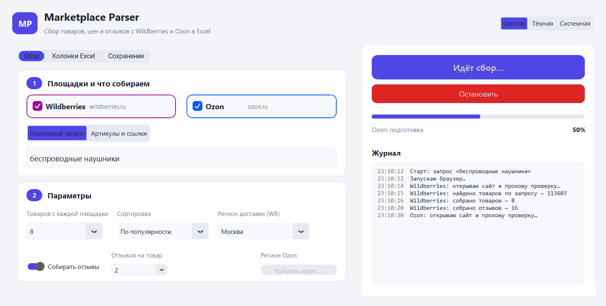
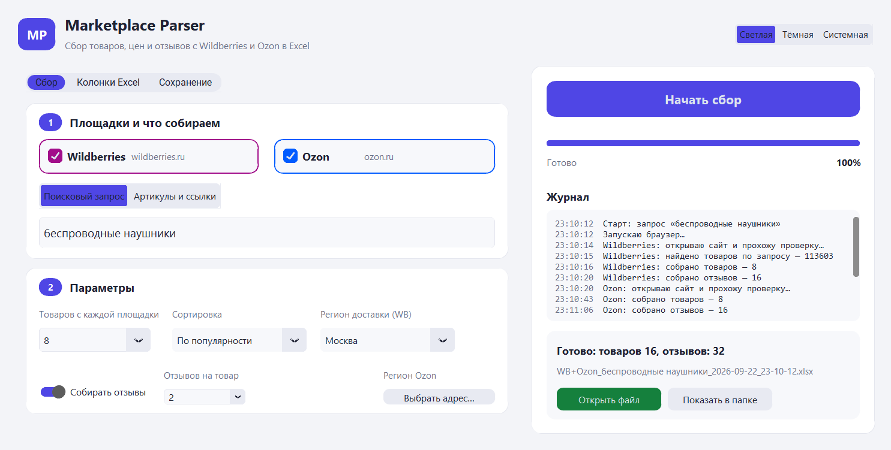
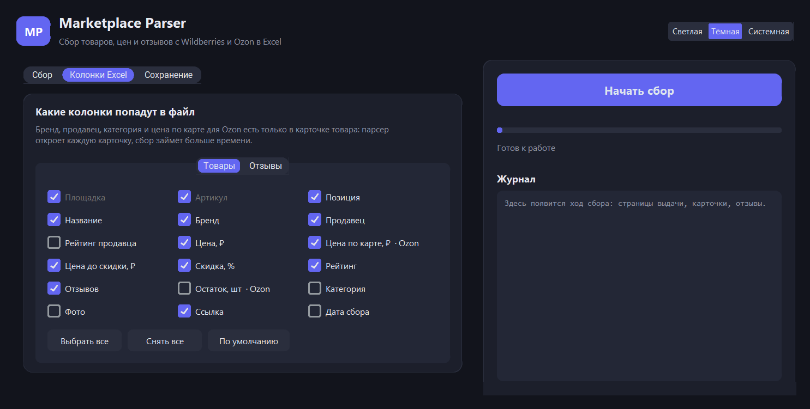

# Marketplace Parser — товары, цены и отзывы с Wildberries и Ozon в Excel

Настольная программа для Windows: собирает карточки товаров, цены и отзывы с Wildberries и Ozon и складывает
их в один оформленный Excel-файл со сводкой. Запускается двойным щелчком по `.exe` — Python заказчику не нужен.

[English version](README.en.md) · [Пример отчёта](docs/example/example-report-wb-ozon.xlsx)



## Что умеет

- **Две площадки в одном отчёте.** Wildberries и Ozon по отдельности или сразу, с единым набором колонок.
- **Два режима сбора.** По поисковому запросу («беспроводные наушники») или по списку артикулов и ссылок —
  для отслеживания цен конкретных товаров, в том числе конкурентов.
- **Отзывы.** До 1000 последних отзывов на товар: дата, оценка, текст, достоинства, недостатки, ответ продавца.
- **Настраиваемые колонки.** 18 полей по товарам и 13 по отзывам — отмечаются галочками, лишнее не попадает в файл.
- **Регион доставки.** 25 городов для Wildberries: цены и сроки зависят от региона.
- **Оформленный Excel.** Листы «Сводка», «Товары», «Отзывы»: автофильтры, закреплённые шапки, формат цен,
  кликабельные ссылки на товар и фото, статистика по площадкам и брендам, график распределения цен.
- **Без ручной работы.** Прогресс, журнал, остановка в любой момент (собранное сохраняется), новый файл на каждый запуск.
- **Работа из командной строки** для запуска по расписанию — тот же `.exe` с параметрами.

| Сбор идёт | Готово |
|---|---|
|  |  |

Колонки Excel выбираются галочками, тёмная тема переключается в шапке:



## Что попадает в Excel

**Лист «Товары»:** площадка, артикул, позиция в выдаче, название, бренд, продавец, рейтинг продавца, цена,
цена по карте (Ozon), цена до скидки, скидка %, рейтинг, число отзывов, остаток (Ozon), категория, фото, ссылка,
дата сбора.

**Лист «Отзывы»:** площадка, артикул, товар, дата, оценка, автор, текст, достоинства, недостатки, вариант товара,
количество фото, «полезно», ответ продавца (Wildberries).

**Лист «Сводка»:** параметры запуска, по каждой площадке — количество товаров, минимальная, средняя, медианная и
максимальная цена, средняя скидка и рейтинг; топ-10 брендов и продавцов; график распределения цен.

## Как это работает

Обе площадки закрыли свои внутренние API антибот-защитой, привязанной к «отпечатку» браузера, поэтому парсер
не подделывает запросы, а работает через настоящий браузер:

1. **Patchright** (сборка Playwright, устойчивая к обнаружению автоматизации) запускает уже установленный на
   компьютере Chrome или Edge в скрытом режиме и открывает сайт.
2. Браузер проходит проверку сайта — у Wildberries это токен в куки `x_wbaas_token`, у Ozon страница
   Antibot Challenge.
3. Дальше запросы к API отправляются изнутри открытой страницы (`fetch`), то есть с правильными куки,
   заголовками и TLS-отпечатком. Wildberries отдаёт по 100 товаров на страницу и до 50 артикулов за запрос,
   Ozon — JSON своих страниц.
4. Открытые данные берутся напрямую: отзывы Wildberries (`feedbacks*.wb.ru`), карта CDN для ссылок на фото.
5. Результат нормализуется в единые модели `Product` и `Review` и выгружается через **openpyxl**.

Профиль браузера сохраняется между запусками, поэтому проверки проходят быстрее, а адрес доставки Ozon
достаточно выбрать один раз (кнопка «Выбрать адрес Ozon…»).

## Системные требования

- Windows 10 или 11, 64-разрядная. На Windows 7 и 8 программа не запускается: её основа — Python 3.13 и
  современный Chrome, а они эти версии Windows больше не поддерживают.
- Google Chrome или Microsoft Edge (Edge предустановлен в Windows 10 и 11) — программа управляет уже
  установленным браузером и свой внутрь не упаковывает.
- Доступ к wildberries.ru и ozon.ru с российского IP.
- Около 400 МБ свободного места.

## Первый запуск: предупреждение Windows и антивирус

Программа не подписана сертификатом разработчика (платная процедура), поэтому Windows встречает её
предупреждением SmartScreen «Система Windows защитила ваш компьютер»: нажмите «Подробнее», затем
«Выполнить в любом случае». Достаточно одного раза.

Антивирус может спрашивать разрешение при каждом действии: программа запускает браузер (`chrome.exe`
или `msedge.exe`) и вспомогательный процесс `node.exe`, который им управляет. Чтобы разрешить всё один
раз, добавьте папку программы в исключения:

- **Защитник Windows:** Параметры → Конфиденциальность и защита → Безопасность Windows → Защита от вирусов
  и угроз → Управление настройками → Исключения → Добавление или удаление исключений → Добавить исключение →
  Папка → выбрать папку с `MarketplaceParser.exe`.
- **Kaspersky:** Настройки → Угрозы и исключения → Настроить исключения / Указать доверенные программы →
  добавить `MarketplaceParser.exe` и снять ограничения на его активность.
- **Другие антивирусы:** раздел называется «Исключения», «Доверенная зона» или «Белый список» — добавьте
  туда папку программы целиком, а не отдельный файл: браузер и `node.exe` запускаются из неё же.

## Установка и запуск

### Готовая программа

1. Скачать архив `MarketplaceParser-*-windows.zip` со страницы [Releases](https://github.com/krein15/marketplace-parser/releases/latest) и распаковать в любую папку.
2. Запустить `MarketplaceParser.exe`.

Нужен установленный Google Chrome или Microsoft Edge (Edge есть в Windows по умолчанию) и доступ к сайтам
маркетплейсов с российского IP.

### Из исходников

```bash
python -m venv .venv
.venv\Scripts\activate
pip install -r requirements.txt
python app.py
```

### Командная строка

```bash
python -m mpparser --wb --ozon -q "беспроводные наушники" -n 100 -r 20 --region Москва -o "D:\Отчёты"
```

Тот же вызов работает у собранного `.exe` — удобно для планировщика задач Windows:

```bash
MarketplaceParser.exe --wb -q "чайник электрический" -n 300 -o "D:\Отчёты"
```

Полный список параметров: `python -m mpparser --help`.

### Сборка .exe

```bash
pip install -r requirements-dev.txt
python -m PyInstaller MarketplaceParser.spec --noconfirm
```

Результат — папка `dist/MarketplaceParser` (около 140 МБ, браузер внутрь не упаковывается).

## Тесты

Разбор ответов проверяется на сохранённых ответах площадок, экспорт — на реальном Excel-файле:

```bash
pip install -r requirements-dev.txt
pytest
ruff check .
```

Когда площадка меняет формат ответа, фикстуры обновляются одной командой: `python tools/dump_fixtures.py`.

## Структура проекта

```
mpparser/
  browser.py            запуск Chrome/Edge, запросы изнутри страницы
  marketplaces/
    base.py             общий интерфейс парсеров, прогресс, остановка
    wildberries.py      поиск, карточки, отзывы, ссылки на фото
    ozon.py             поиск, карточки, отзывы
  export/excel.py       листы «Товары», «Отзывы», «Сводка»
  fields.py             реестр колонок Excel
  regions.py            города и коды регионов WB
  runner.py             сценарий сбора целиком
  settings.py           настройки и их хранение
  gui/                  окно на CustomTkinter
tools/                  иконка, скриншоты, обновление фикстур и регионов
tests/                  тесты и фикстуры
```

## Ограничения

- **Остаток товара на Wildberries** не выгружается: анонимным посетителям сайт отдаёт одно и то же
  условное число вместо реального остатка.
- **Бренд, продавец, категория и цена по карте у Ozon** есть только в карточке товара. Если эти колонки
  включены, парсер открывает каждую карточку, и сбор идёт медленнее (примерно 1–2 секунды на товар).
- **Отзывы Wildberries** отдаются порциями до 1000 последних на товар.
- Площадки меняют свои API без предупреждения. Парсер подстраивается там, где это возможно (например, сам
  берёт актуальную версию поискового API с сайта), но при крупных изменениях требуется правка парсера —
  для этого и нужны тесты с фикстурами.
- Собираются только общедоступные данные, которые сайт показывает любому посетителю, с паузами между
  запросами. В отзывах есть публичные имена авторов — используйте выгрузку по назначению и по закону.

## Планы

- Сбор по ссылке на категорию (интерфейс парсеров уже готов к этому: `MarketplaceParser.category`).
- Накопление истории цен в одном файле для отслеживания динамики.
- Поддержка прокси и запуск по расписанию из самой программы.

## Автор

**Бондаренко Николай** — разработка парсеров и автоматизации на Python.
Нужен похожий парсер или доработка под вашу задачу — пишите.

- Telegram: [@krein1](https://t.me/krein1)
- Email: [reinkolya@gmail.com](mailto:reinkolya@gmail.com)
- GitHub: [krein15](https://github.com/krein15)

Лицензия: [MIT](LICENSE).
