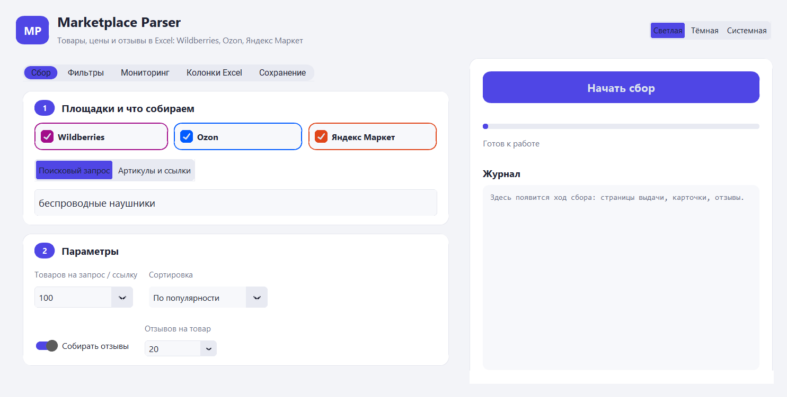
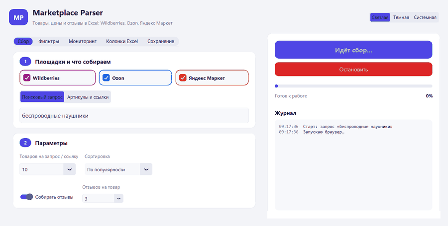
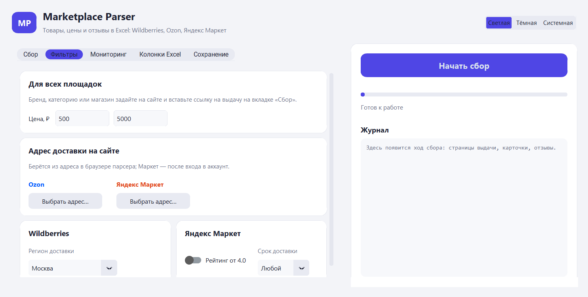
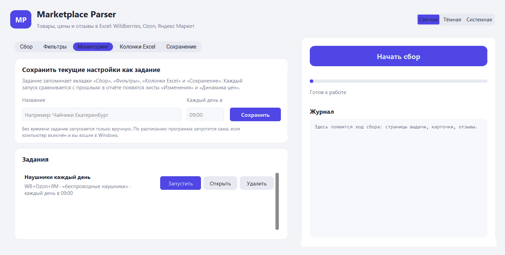
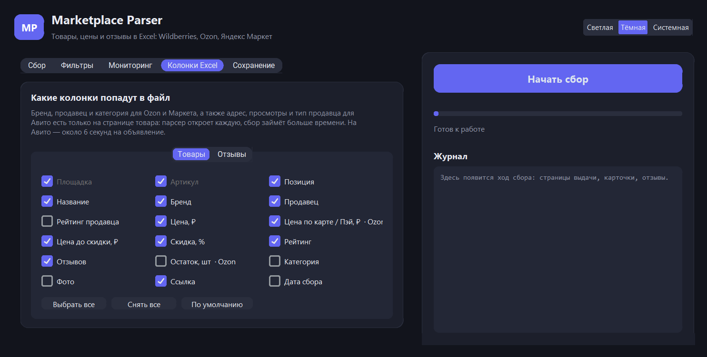

# Marketplace Parser — товары, цены и отзывы маркетплейсов в Excel

[](https://github.com/krein15/marketplace-parser/actions/workflows/tests.yml)

Настольная программа для Windows: собирает карточки товаров, цены и отзывы с **Wildberries, Ozon и Яндекс
Маркета** в один оформленный Excel-файл, а при ежедневном запуске показывает, что подорожало, что подешевело
и что пропало из выдачи. Запускается двойным щелчком по `.exe` — Python заказчику не нужен.

[English version](README.en.md) · [Пример отчёта](docs/example/example-report.xlsx) · [Скачать сборку](https://github.com/krein15/marketplace-parser/releases/latest)



## Что умеет

- **Три площадки в одном отчёте.** Wildberries, Ozon и Яндекс Маркет по отдельности или сразу, с общим набором колонок.
- **Три способа задать, что собирать.** Поисковый запрос, список артикулов и ссылок на товары, ссылка на выдачу
  или категорию с фильтрами, настроенными прямо на сайте.
- **Мониторинг цен.** Задание запоминает настройки и запускается каждый день через Планировщик Windows.
  В отчёте появляются листы «Изменения» (подешевел, подорожал, новый, выпал из выдачи) и «Динамика цен».
- **Фильтры.** Цена для всех площадок; регион доставки WB (25 городов); у Маркета — рейтинг от 4.0 и срок
  доставки; адрес доставки Ozon и Маркета выбирается в браузере парсера один раз.
- **Отзывы.** До 1000 последних отзывов на товар: дата, оценка, текст, достоинства, недостатки, ответ продавца.
- **Настраиваемые колонки.** 18 полей по товарам и 13 по отзывам — отмечаются галочками, лишнее в файл не попадает.
- **Расширяемость.** Площадка — это модуль: новую можно добавить, не трогая программу (см. «Как добавить площадку»).
- **Без ручной работы.** Прогресс, журнал, остановка в любой момент (собранное сохраняется), новый файл на каждый запуск.
- **Командная строка** для запуска по расписанию — тот же `.exe` с параметрами.



| Фильтры | Мониторинг |
|---|---|
|  |  |

Колонки Excel выбираются галочками, тёмная тема переключается в шапке:



## Что попадает в Excel

**«Товары»** — площадка, артикул, позиция в выдаче, название, бренд, продавец и его рейтинг, цена, цена по
карте или с Пэй (Ozon и Маркет), цена до скидки, скидка %, рейтинг, число отзывов, остаток (Ozon), категория,
фото, ссылка, дата сбора.

**«Отзывы»** — площадка, артикул, товар, дата, оценка, автор, текст, достоинства, недостатки, вариант товара,
количество фото, «полезно», ответ продавца (WB).

**«Сводка»** — параметры запуска и активные фильтры, итоги по каждой площадке (количество, минимальная,
средняя, медианная и максимальная цена, средняя скидка и рейтинг), топ-10 брендов и продавцов, график
распределения цен.

**«Изменения»** и **«Динамика цен»** появляются со второго запуска задания: что подешевело и подорожало
(с разницей в ₽ и %), что появилось и что пропало из выдачи, и цены за последние 14 запусков.

## Как это работает

Площадки закрыли свои внутренние API антибот-защитой, привязанной к «отпечатку» браузера, поэтому парсер
не подделывает запросы, а работает через настоящий браузер:

1. **Patchright** (сборка Playwright, устойчивая к обнаружению автоматизации) запускает уже установленный
   Chrome или Edge в скрытом режиме и открывает сайт.
2. Браузер проходит проверку площадки: у Wildberries это токен в куки, у Ozon — страница Antibot Challenge,
   у Маркета — обычная загрузка страницы.
3. Дальше запросы идут изнутри открытой страницы, то есть с правильными куки, заголовками и TLS-отпечатком.
   Wildberries отдаёт по 100 товаров на страницу, Ozon — JSON своих страниц, Маркет — HTML выдачи и карточек.
4. Результат нормализуется в единые модели `Product` и `Review` и выгружается через **openpyxl**.

Профиль браузера сохраняется между запусками: проверки проходят быстрее, а адрес доставки достаточно выбрать
один раз.

## Как добавить площадку

Ядро не знает ни одного маркетплейса по имени. Площадка описывается одним объектом: ключ, название, цвет,
класс парсера, распознавание своих ссылок, свои колонки Excel и свои фильтры. Из этого описания сами
собираются окно программы, флаги командной строки, отчёт и ключ истории мониторинга.

```python
MARKETPLACE = Marketplace(
    key="wb",
    title="Wildberries",
    parser=WildberriesParser,
    item_patterns=(ITEM_LINK,),
    options=(Option(key="region", title="Регион доставки", kind="choice", default="Москва", choices=REGIONS),),
)
```

Встроенные площадки объявляют себя в своих модулях. Отдельный пакет подключается через точку входа — после
установки площадка появляется в программе, после удаления исчезает, остальное продолжает работать:

```toml
[project.entry-points."mpparser.marketplaces"]
avito = "mpparser_avito:MARKETPLACE"
```

**Авито** сделан таким модулем и поставляется отдельно, по запросу: там продавцы — частные лица, а их имена и
отзывы относятся к персональным данным (152-ФЗ). Напишите, если нужен.

## Системные требования

- Windows 10 или 11, 64-разрядная. На Windows 7 и 8 программа не запускается: её основа — Python 3.13 и
  современный Chrome, а они эти версии Windows больше не поддерживают.
- Google Chrome или Microsoft Edge (Edge предустановлен в Windows 10 и 11) — программа управляет уже
  установленным браузером и свой внутрь не упаковывает.
- Доступ к сайтам площадок с российского IP.
- Около 400 МБ свободного места.

## Первый запуск: предупреждение Windows и антивирус

Программа не подписана сертификатом разработчика (платная процедура), поэтому Windows встречает её
предупреждением SmartScreen «Система Windows защитила ваш компьютер»: нажмите «Подробнее», затем
«Выполнить в любом случае». Достаточно одного раза.

Антивирус может спрашивать разрешение при каждом действии: программа запускает браузер (`chrome.exe`
или `msedge.exe`) и вспомогательный процесс `node.exe`, который им управляет. Чтобы разрешить всё один
раз, добавьте папку программы в исключения:

- **Защитник Windows:** Параметры → Конфиденциальность и защита → Безопасность Windows → Защита от вирусов
  и угроз → Управление настройками → Исключения → Добавление или удаление исключений → Добавить исключение →
  Папка → выбрать папку с `MarketplaceParser.exe`.
- **Kaspersky:** Настройки → Угрозы и исключения → Настроить исключения / Указать доверенные программы →
  добавить `MarketplaceParser.exe` и снять ограничения на его активность.
- **Другие антивирусы:** раздел называется «Исключения», «Доверенная зона» или «Белый список» — добавьте
  туда папку программы целиком, а не отдельный файл: браузер и `node.exe` запускаются из неё же.

## Установка и запуск

### Готовая программа

1. Скачать архив `MarketplaceParser-*-windows.zip` со страницы [Releases](https://github.com/krein15/marketplace-parser/releases/latest) и распаковать в любую папку.
2. Запустить `MarketplaceParser.exe`.

### Из исходников

```bash
python -m venv .venv
.venv\Scripts\activate
pip install -r requirements.txt
python app.py
```

### Командная строка

```bash
python -m mpparser --wb --ozon --ym -q "беспроводные наушники" -n 100 -r 20 --price-min 500 --wb-region Казань
```

Сохранённое задание мониторинга запускается по названию — именно так его вызывает Планировщик Windows:

```bash
MarketplaceParser.exe --task "Наушники каждый день"
```

Полный список параметров: `python -m mpparser --help`. Флаги площадок и их фильтров создаются автоматически
из описаний, поэтому у установленного модуля Авито появятся свои `--avito`, `--avito-city` и остальные.

### Сборка .exe

```bash
pip install -r requirements-dev.txt
python -m PyInstaller MarketplaceParser.spec --noconfirm
```

Результат — папка `dist/MarketplaceParser` (около 145 МБ, браузер внутрь не упаковывается).

## Тесты

Разбор ответов площадок проверяется на сохранённых ответах, экспорт — на реальном Excel-файле, контракт
площадки — на выдуманном маркетплейсе, который регистрируется как внешний модуль:

```bash
pip install -r requirements-dev.txt
pytest
ruff check .
```

Тесты и линтер запускаются на каждый пуш в GitHub Actions — значок со статусом стоит в начале файла.
Когда площадка меняет формат ответа, фикстуры обновляются командой `python tools/dump_fixtures.py <площадка>`.

## Структура проекта

```
mpparser/
  plugins.py            контракт площадки и реестр: описание, колонки, фильтры, поиск модулей
  browser.py            запуск Chrome/Edge, запросы изнутри страницы
  marketplaces/
    base.py             общий интерфейс парсеров, прогресс, остановка
    wildberries.py      поиск, карточки, отзывы, фото, регион
    ozon.py             поиск, карточки, отзывы, цена по карте
    yandex_market.py    выдача, карточки, отзывы, фильтры
  monitoring.py         история цен, сравнение запусков, «Изменения» и «Динамика цен»
  tasks.py, scheduler.py  задания и Планировщик Windows
  export/excel.py       листы отчёта
  fields.py             реестр колонок
  runner.py             сценарий сбора целиком
  settings.py           настройки и их хранение
  gui/                  окно на CustomTkinter
tools/                  иконка, скриншоты, запись GIF, обновление фикстур и регионов
tests/                  тесты и фикстуры
```

## Ограничения

- **Остаток товара на Wildberries** не выгружается: анонимным посетителям сайт отдаёт одно и то же
  условное число вместо реального остатка.
- **Бренд, продавец, категория и цена по карте** у Ozon и Маркета есть только в карточке товара. Если эти
  колонки включены, парсер открывает каждую карточку, и сбор идёт медленнее.
- **Регион Маркета** без входа в аккаунт определяется по IP; цены почти не зависят от региона, меняются
  наличие и сроки доставки.
- **«Выпал из выдачи»** часто означает смену рекламных мест, а не снятие товара с продажи — в отчёте это поясняется.
- **Площадки меняют разметку.** Каждый парсер покрыт тестами на сохранённых ответах; когда что-то ломается,
  тесты показывают, что именно.
- Собираются только общедоступные данные, которые сайт показывает любому посетителю, с паузами между
  запросами. В отзывах есть публичные имена авторов — используйте выгрузку по назначению и по закону.

## Планы

- Уведомления в Telegram о заметных изменениях цен.
- Выгрузка в Google Таблицы.
- Больше площадок отдельными модулями.

## Автор

**Бондаренко Николай** — разработка парсеров и автоматизации на Python.
Нужен похожий парсер или доработка под вашу задачу — пишите.

- Telegram: [@krein1](https://t.me/krein1)
- Email: [reinkolya@gmail.com](mailto:reinkolya@gmail.com)
- GitHub: [krein15](https://github.com/krein15)

Лицензия: [MIT](LICENSE).
